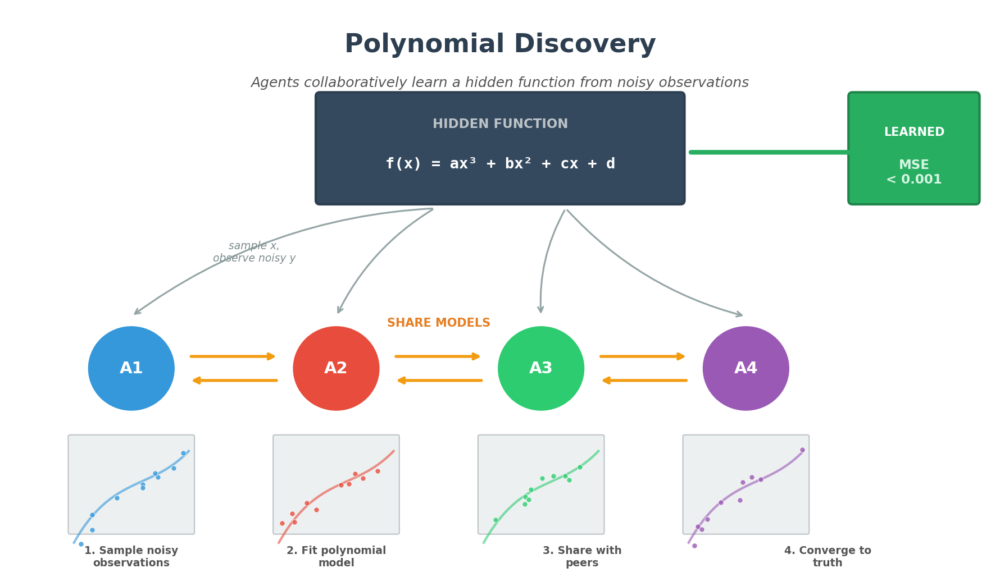
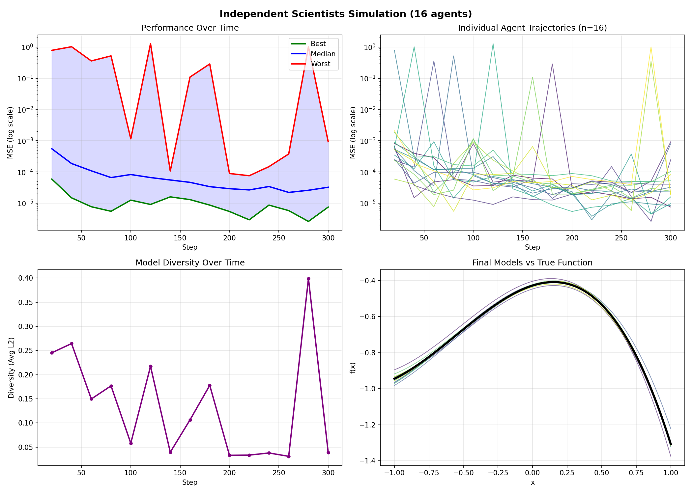
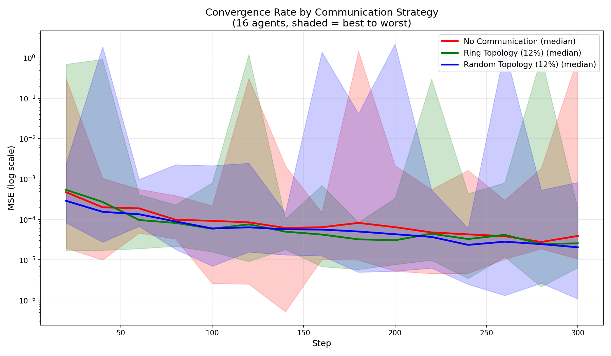
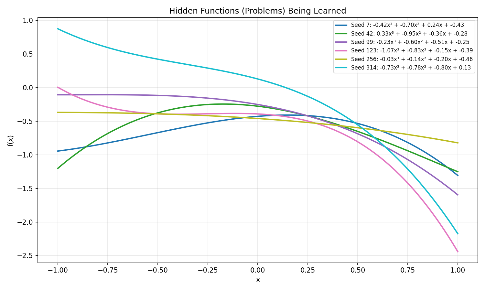
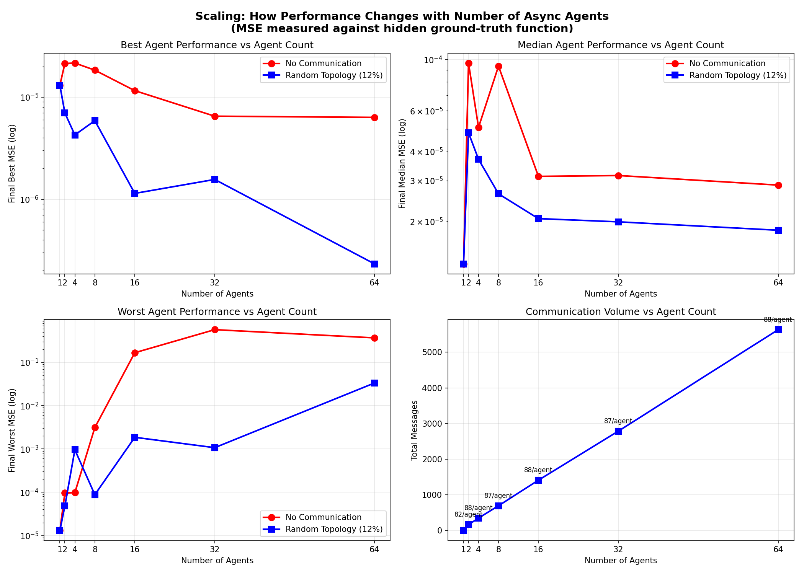
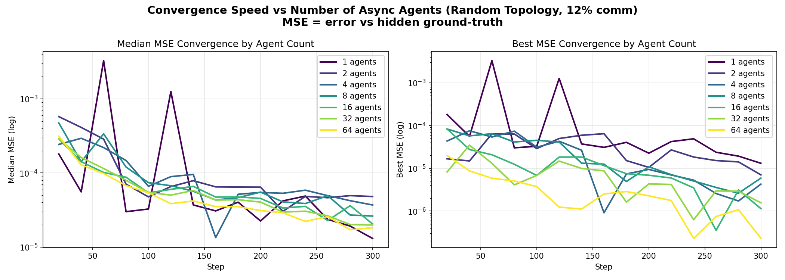

# Polynomial Discovery

Multi-agent simulation where autonomous agents collaboratively learn a hidden cubic polynomial through noisy observations and peer-to-peer communication.



## Problem

Multiple independent "scientist" agents attempt to discover a hidden cubic polynomial:

```
f(x) = ax³ + bx² + cx + d
```

**What agents know:**
- The functional form is cubic (4 parameters to learn)
- They can sample x values from [-1, 1]

**What agents DON'T know:**
- The true coefficients (a, b, c, d)
- They only observe noisy measurements: `y = f(x) + noise`

**Evaluation:**
- MSE is measured against the **hidden ground-truth function** on a dense evaluation grid
- This is an "oracle" metric - agents cannot compute it themselves

## Agent Architecture

Each agent runs an **asynchronous loop** (not synchronized with other agents):

1. **Sample**: Draw random x, observe noisy y
2. **Fit**: Periodically refit model parameters using least squares
3. **Receive**: Process messages from peers (model parameters)
4. **Integrate**: Blend peer models with own (if peer seems better)
5. **Send**: With probability `COMM_PROB`, share model with a random peer

## Installation

```bash
pip install -r requirements.txt
```

## Usage

### Basic Run

```bash
python independent_scientists_academy.py
```

### Configuration via Environment Variables

```bash
export N_AGENTS=16
export COMM_PROB=0.12
export TOPOLOGY=ring    # ring | random | all
export STEPS=300
python independent_scientists_academy.py
```

### Comparison Scripts

```bash
# Compare communication strategies (none vs ring vs random)
python compare_communication.py

# Compare across different hidden functions
python compare_problems.py

# Test scaling with agent count (1, 2, 4, 8, 16, 32, 64)
python compare_agent_counts.py
```

## Sample Results

### Single Run Dashboard (16 agents, 300 steps)



This shows:
- **Top-left**: MSE over time (best, median, worst agents)
- **Top-right**: Individual agent MSE trajectories
- **Bottom-left**: Model diversity decreasing as agents converge
- **Bottom-right**: Final agent models overlaid on true function

### Communication Strategy Comparison



Comparing no communication vs ring topology vs random topology:

| Metric | No Comm | Ring (12%) | Random (12%) |
|--------|---------|------------|--------------|
| Final Best MSE | 0.000010 | 0.000006 | **0.000001** |
| Final Median MSE | 0.000039 | 0.000025 | **0.000020** |
| Final Worst MSE | **1.013** | **0.000182** | 0.000830 |
| Total Messages | 0 | 1,355 | 1,403 |

**Key finding**: Communication dramatically reduces worst-case performance. Random topology gives slightly better average performance due to shorter path lengths.

### Performance Across Different Problems

Tested across 6 different hidden cubic functions:

| Strategy | Best MSE (mean±std) | Median MSE (mean±std) | Worst MSE (mean±std) |
|----------|--------------------|-----------------------|---------------------|
| No Communication | 0.000016 ± 0.000003 | 0.000031 ± 0.000002 | **0.56 ± 0.82** |
| Ring (12%) | 0.000005 ± 0.000004 | 0.000028 ± 0.000007 | 0.19 ± 0.27 |
| Random (12%) | **0.000004 ± 0.000004** | **0.000025 ± 0.000006** | **0.08 ± 0.12** |

**Win rates** (best median MSE per problem):
- Random (12%): 4/6 wins (67%)
- Ring (12%): 2/6 wins (33%)
- No Communication: 0/6 wins (0%)



### Agent Count Scaling



| Agents | With Comm | No Comm | Improvement | Messages |
|--------|-----------|---------|-------------|----------|
| 1 | 0.000013 | 0.000013 | 1.00x | 0 |
| 2 | 0.000048 | 0.000096 | 2.00x | 163 |
| 4 | 0.000037 | 0.000051 | 1.37x | 350 |
| 8 | 0.000026 | 0.000093 | **3.56x** | 694 |
| 16 | 0.000021 | 0.000031 | 1.52x | 1,412 |
| 32 | 0.000020 | 0.000032 | 1.58x | 2,786 |
| 64 | 0.000018 | 0.000029 | 1.57x | 5,631 |

**Key findings**:
- Sweet spot around 8-16 agents
- Linear message scaling (~88 msgs/agent)
- Best agent keeps improving with more agents
- Diminishing returns on median performance after ~16 agents



## Key Insights

1. **Communication helps most for worst-case**: Isolated agents can get stuck in local minima; peer information helps escape

2. **Random topology > Ring topology**: Shorter average path length allows faster information spread across the network

3. **Sparse communication is sufficient**: 12% send probability (~80 messages per agent) provides most of the benefit

4. **Asynchronous operation works**: No need for synchronized steps; agents learn effectively at their own pace

5. **Scaling efficiency**: More agents help exploration, but communication overhead grows linearly

## Files

| File | Description |
|------|-------------|
| `independent_scientists_academy.py` | Main simulation with configurable parameters |
| `compare_communication.py` | Compare no-comm vs ring vs random topology |
| `compare_problems.py` | Test across 6 different hidden functions |
| `compare_agent_counts.py` | Scale from 1 to 64 agents |
| `requirements.txt` | Python dependencies |
