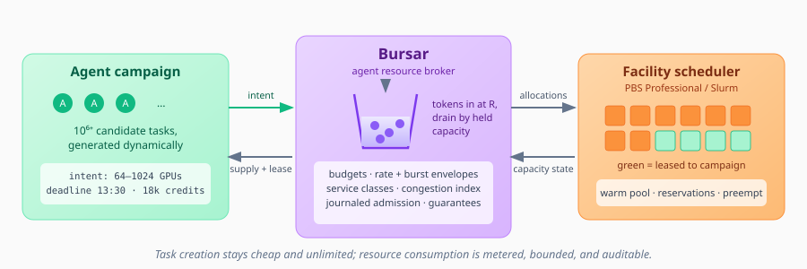
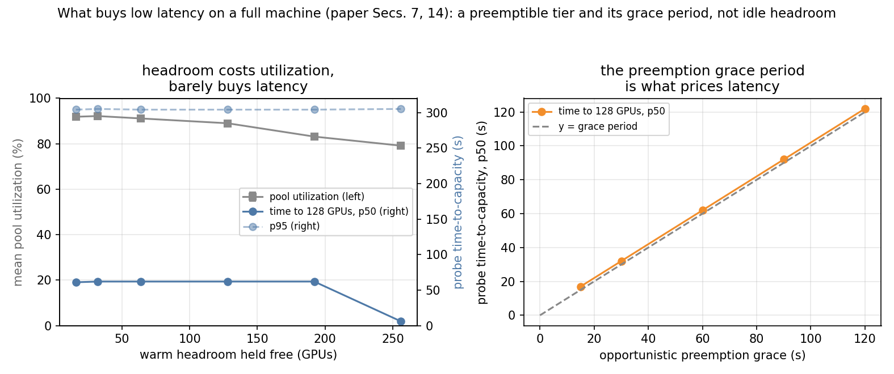
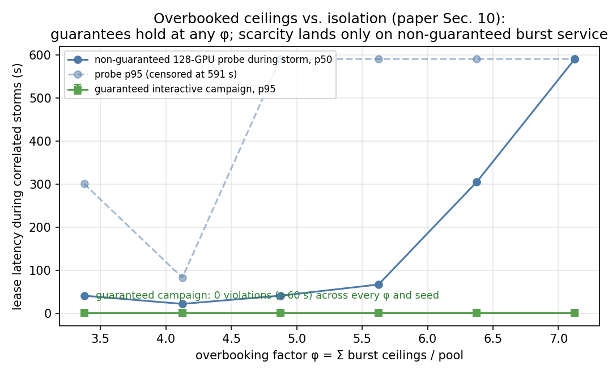
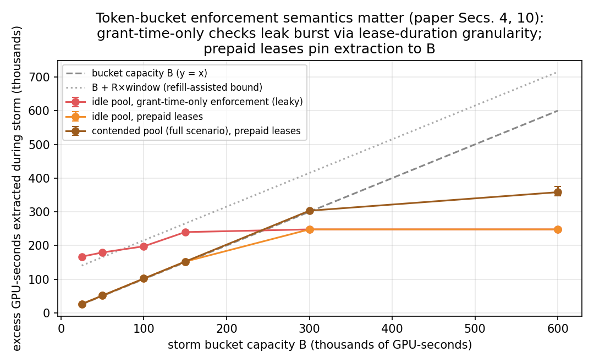

# Bursar: Agent-Native HPC

*Campaign-level resource leases and machine-speed back pressure for autonomous science*



HPC facilities were built around human-scale submission: a person prepares jobs, queues a manageable number, and waits. Agentic scientific workflows invert every one of those assumptions — an agent may make thousands of resource decisions per second, generate task spaces with millions of contingent branches, and need answers in seconds because computation sits inside a closed experimental or reasoning loop.

**The challenge:** Simply removing job-count limits would expose the batch scheduler to machine-scale demand while leaving the real scarcity problem untouched. An allocation says how many GPU-hours a project may consume over months; it says nothing about how much it may consume *right now*, at what latency, and at what cost to everyone else on a fully subscribed machine.

**A potential solution:** *Bursar* — named for the institutional officer who meters budgets and, here, bursts — is a thin Agent Resource Broker above the facility scheduler (PBS Professional, Slurm). Projects receive campaign-level *resource envelopes*: a credit budget plus flow controls — guaranteed rate, sustained ceiling, burst allowance metered by a token bucket, and a service class that makes latency an explicit, priced attribute. Agents acquire short-lived leases against those envelopes through a machine API and run arbitrarily many fine-grained tasks inside them. The facility governs the *rate of resource consumption*, never the number of tasks: task creation stays cheap and unlimited, while consumption is bounded, machine-readable, and auditable.

---

## How an application interacts with Bursar

Your project registers a **campaign** and receives an envelope. At runtime your application talks to Bursar's API, not the scheduler: it queries **supply** (free capacity, congestion index, its own token balance, expected wait per grant path), states an **intent** ("64–1,024 GPUs for independent tasks, deadline 13:30, max spend 18,000 credits"), and receives a **lease** — typically in seconds from a warm pool. Inside the lease, your execution layer (Parsl, Ray, Flux, MPI pools…) dispatches tasks at whatever rate it likes; the facility scheduler never sees them. As prices and capacity shift, an adaptive agent reorders its science to run the highest-value work when capacity is cheap — back pressure becomes an input to scientific planning rather than a queue you wait in.

---

## Documents

<div style="display: flex; flex-wrap: wrap; gap: 1.5rem; margin: 2rem 0;">

<div style="flex: 1; min-width: 300px; border: 1px solid #ddd; border-radius: 8px; padding: 1rem;">
<h3><a href="bursar-proposal.pdf">Bursar: Agent-Native HPC</a></h3>
<p><em>The proposal (discussion draft, August 2026)</em></p>
<p>Campaign envelopes, token-bucket back pressure, service classes and credit pricing, the supply/intent API, warm/reclaim/cold lease paths, admission control and overbooking policy, governance and failure semantics, and a nine-month two-phase ALCF pilot with quantitative success thresholds.</p>
<p><strong>Key topics:</strong> resource envelopes, token buckets, lease paths, congestion index, journaled admission, pilot design</p>
</div>

<div style="flex: 1; min-width: 300px; border: 1px solid #ddd; border-radius: 8px; padding: 1rem;">
<h3><a href="replay.html">Live simulation replay</a></h3>
<p><em>Interactive demo — press Play</em></p>
<p>An animated replay of the prototype: a 512-GPU pool, two hours simulated, five campaigns. Watch an adversarial burst storm get throttled by its token bucket, a small interactive campaign keep 1-second grant latency straight through the storm, and an adaptive agent produce ~2.2&times; the science of a naive one at ~2.5&times; lower cost with identical tasks.</p>
<p><strong>Shows:</strong> pool occupancy, bucket levels, congestion multiplier, every lease grant by latency and path, and the I/O + inference envelope dimensions in action</p>
</div>

</div>

---

## Prototype

The [`prototype/`](prototype/) directory contains a runnable, zero-dependency simulation of the Bursar policy engine (the paper's Phase 1: broker + synthetic load — the cluster is simulated, the policy engine is real):

```
cd prototype
python3 main.py && open report.html   # offline simulation + animated replay
python3 api.py --speed 20             # REST facade: the broker as a live service
python3 demo_client.py                # an agent negotiating with it over HTTP
python3 experiments.py                # parameter sweeps -> figures/ (needs matplotlib)
```

It demonstrates, in under a second of wall-clock time:

1. **Back pressure works** — an adversarial campaign demanding its 384-GPU burst ceiling continuously is held to a 148-GPU average and forced back toward its 64-GPU sustained rate as its token bucket drains — and under prepaid-lease enforcement it can never hold a burst its tokens cannot pay for.
2. **Isolation holds** — a small interactive campaign sees p95 grant latency of 1 s *during* the storm, because consumption beyond any campaign's guarantee can never squeeze another campaign's unmet guarantee.
3. **Adaptivity pays** — given identical task sets, an agent that reads supply signals produces ~2.2&times; the science at ~2.5&times; lower credit cost per unit than one that ignores them, by deferring low-value work to cheap capacity, preferring high-value-per-gigabyte tasks when I/O-starved, and not holding GPUs it cannot feed.
4. **Utilization survives** — preemptible backfill recovers idle capacity (~82% mean utilization in the default scenario).
5. **Envelopes are multi-dimensional** — filesystem bandwidth and model inference are metered with the same token-bucket semantics as GPUs (throttle-at-source): the I/O-blind naive agent loses ~40% of its science to I/O throttling, and the storm's inference spam is pinned to its sustained rate. Even the adversary's *thinking* is metered.
6. **Governance is auditable** — every admission decision is journaled with its rule inputs (service class, fair-share deficit, token state).
7. **The broker is a service, not a library** — `api.py` exposes the supply, lease, and consumption APIs over HTTP with campaign-scoped bearer tokens and an OpenAPI description at `/openapi.json`; `demo_client.py` shows an agent negotiating the full loop remotely.

---

## Measured findings from parameter sweeps

`experiments.py` sweeps the scenario's policy knobs (multiple seeds per point; latency measured by a standardized 128-GPU probe timed to full capacity). Three findings, now folded into the paper:

**1. The preemption grace period — not idle headroom — prices latency.** Reserving more warm headroom costs utilization but barely moves time-to-capacity, because a work-conserving preemptible tier refills spare GPUs anyway; median time-to-128-GPUs instead tracks the opportunistic preemption grace one-for-one.



**2. Guarantees survive 7× overbooking.** With correlated adversarial storms pushing the sum of burst ceilings to 7.1× the pool, the guaranteed campaign stays at p95 = 1 s with zero violations at every overbooking factor; scarcity lands entirely on non-guaranteed burst service.



**3. Token buckets need lease-aware enforcement.** Checking tokens only at grant instants leaks burst through lease-duration granularity: an adversary with a 25k GPU-second bucket extracted 167k GPU-seconds. *Prepaid leases* — the above-sustained portion of a lease must be token-covered for its whole duration — pin extraction to B almost exactly, and are now the broker's default.



---

## Relationship to the Resource Rights Architecture

Bursar and the [Resource Rights Architecture](../ResourceRights/) are complementary halves of one problem. Resource rights govern **authority**: what an agent is permitted to do, delegated and revocable across federated facilities. Bursar governs **capacity and rate**: how fast a permitted campaign may consume scarce resources, at what latency, and at what opportunity cost. An agent presents a resource right to prove it *may* act; Bursar decides whether it may act *now*, and meters what acting costs.

---

*Status: discussion draft and simulation prototype. A facility pilot (PBS Professional binding at ALCF, Slurm binding for portability) is proposed in the paper.*
