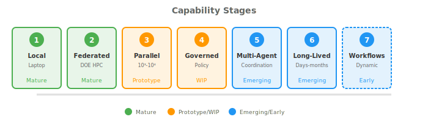

# Agentic Capabilities: A Tutorial Introduction

*Deployment patterns from local execution to autonomous systems*

We provide here example code that implements a set of agentic capabilities of increasing sophistication, from local execution to governed, autonomous scientific systems.

The code makes use of two **complementary agent frameworks**:

* [**LangGraph**](https://www.langchain.com/langgraph) — LLM reasoning, tool calling, and structured workflows. Handles the *intelligence* layer.

* [**Academy**](https://academy-agents.org) — Distributed execution, federation, and HPC integration. Handles the *distribution* layer.

**Why both?** Production scientific agents need both capabilities. LangGraph excels at LLM orchestration but runs in a single process. Academy excels at distributed execution but doesn't handle LLM reasoning. Together, they enable intelligent agents that run anywhere—from laptops to federated DOE infrastructure.

See [these slides](https://docs.google.com/presentation/d/1Djvi5_PqvZl1v1xO2nWJf3k7P-35XGcH) for a brief review of these two systems, and one more, Microsoft Agent Framework.

There are excellent tutorial materials online for [LangGraph](https://docs.langchain.com/oss/python/langgraph/quickstart) and for [Academy](https://docs.academy-agents.org/stable/guides/tutorial/). Here we focus on showing how to use the two systems, independently and together, to realize scalable agentic systems for science.

## Getting Started: Tutorial Review of Agentic Patterns

**[Building Scientific Agents](local-agents/getting-started/)** — Learn to build production scientific agents:

1. **[LLM Agents](local-agents/getting-started/1-llm-agents.md)** — Build agents that reason and call tools (LangGraph)
2. **[Distributed Agents](local-agents/getting-started/2-distributed-agents.md)** — Run agents across machines (Academy)
3. **[Production Agents](local-agents/getting-started/3-production-agents.md)** — Combine both for real deployments

| Additional Resources | |
|----------------------|---|
| [LLM Configuration](local-agents/llm-configuration/) | Configure OpenAI, Ollama, or FIRST backends |

## Code Samples by Area

The sample code shows how to implement a series of increasingly sophisticated agentic patterns.

<h3>1. <a href="local-agents/">Local Agent Execution</a></h3>

LangGraph, Academy

Your on-ramp to CAF. Run persistent, stateful agents on a laptop or workstation—no federation required.

<strong>Status:</strong> Mature

<h3>2. <a href="federated-agents/">Federated Agent Execution</a></h3>

LangGraph + Academy

Cross-institutional agent execution under federated identity and policy.

<strong>Status:</strong> Mature

<h3>3. <a href="scale-inference/">Massively Parallel Agent Inference</a></h3>

LangGraph, Aegis

Fan out thousands of LLM requests in parallel on HPC.

<strong>Status:</strong> Prototype

<h3>4. <a href="governed-tool-use/">Governed Tool Use at Scale</a></h3>

Academy governance

Invoke expensive, stateful, or dangerous tools under proactive policy enforcement.

<strong>Status:</strong> WIP

<h3>5. <a href="multi-agent-coordination/">Multi-Agent Coordination</a></h3>

Shared state + policy + budgets

Many agents under shared governance—within one institution or across many.

<strong>Status:</strong> Emerging

<h3>6. <a href="long-lived-agents/">Long-Lived Autonomous Agents</a></h3>

Lifecycle management

Agents that persist for days to months, maintaining state, memory, and goals.

<strong>Status:</strong> Emerging

<h3>7. <a href="agent-workflows/">Agent-Mediated Scientific Workflows</a></h3>

Dynamic workflow construction

Agents dynamically construct, adapt, and execute scientific workflows.

<strong>Status:</strong> Early

---

## Maturity Levels

| Level | Meaning |
|-------|---------|
| **Mature** | Documented with working examples on this site |
| **Prototype** | Demonstrated on DOE systems; documentation in progress |
| **WIP** | Work in progress |
| **Emerging** | Active development; early adopters welcome |
| **Early** | Early stage; design and prototyping |

---

## Capability Matrix

| Stage | Capability | What you can do | CAF Components | Where it runs | Scale | Status |
|:-----:|------------|-----------------|----------------|---------------|-------|:------:|
| 1 | [Local Agent Execution](local-agents/) | Run persistent, stateful agents | LangGraph | Laptop, workstation, VM | Single agent | Mature |
| 2 | [Federated Agent Execution](federated-agents/) | Invoke tools under federated identity | LangGraph + Academy | DOE HPC | Multi-resource | Mature |
| 3 | [Parallel Agent Inference](scale-inference/) | Fan out thousands of LLM requests | LangGraph + FIRST | HPC accelerators | O(10³–10⁴) streams | Prototype |
| 4 | [Governed Tool Use](governed-tool-use/) | Invoke tools under policy enforcement | Academy governance | DOE HPC | O(10²–10³) tools | WIP |
| 5 | [Multi-Agent Coordination](multi-agent-coordination/) | Coordinate agents under shared governance | Shared state + policy | Distributed | O(10²–10³) agents | Emerging |
| 6 | [Long-Lived Agents](long-lived-agents/) | Persistent agents with memory and goals | Lifecycle management | Any | Days–months | Emerging |
| 7 | [Agent Workflows](agent-workflows/) | Dynamic workflow construction | Workflow integration | DOE infrastructure | Varies | Early |

**Scale notation:** O(10²) means "order of 100" (tens to hundreds), O(10³) means "order of 1,000" (hundreds to thousands), etc. These indicate typical operating ranges, not hard limits.

---

## Examples Index

All examples support multiple LLM backends (OpenAI, FIRST, Ollama) and include a mock mode for testing without API keys.

### Local Agents

| Example | Tech | Description | Key Pattern |
|---------|------|-------------|-------------|
| [AgentsCalculator](local-agents/AgentsCalculator/) | LangGraph | Minimal tool-calling agent | `@tool` decorator |
| [AgentsRAG](local-agents/AgentsRAG/) | LangGraph | Retrieval-augmented generation | Vector search |
| [AgentsDatabase](local-agents/AgentsDatabase/) | LangGraph | Natural language data queries | Pandas integration |
| [AgentsAPI](local-agents/AgentsAPI/) | LangGraph | External API calls | PubChem REST API |
| [AgentsConversation](local-agents/AgentsConversation/) | LangGraph | Stateful conversation | Short/long-term memory |
| [AgentsLangGraph](local-agents/AgentsLangGraph/) | LangGraph | 5-agent pipeline | StateGraph orchestration |
| [AgentsAcademyBasic](local-agents/AgentsAcademyBasic/) | Academy | Minimal Academy example | Two-agent messaging |
| [AgentsRemoteTools](local-agents/AgentsRemoteTools/) | Academy | Remote tool invocation | Coordinator + ToolProvider |
| [AgentsPersistent](local-agents/AgentsPersistent/) | Academy | Persistent workflows | Checkpoint and resume |
| [AgentsFederated](local-agents/AgentsFederated/) | Academy | Federated collaboration | Cross-institutional (DOE labs) |
| [AgentsAcademy](local-agents/AgentsAcademy/) | Academy | 5-agent pipeline | Agent-to-agent messaging |
| [AgentsAcademyHubSpoke](local-agents/AgentsAcademyHubSpoke/) | Academy | Hub-and-spoke pattern | Central orchestrator |
| [AgentsAcademyDashboard](local-agents/AgentsAcademyDashboard/) | Academy | Live progress dashboard | Rich TUI |
| [AgentsHybrid](local-agents/AgentsHybrid/) | Both | Academy + LangGraph hybrid | Distributed LLM agents |

### Federated Agents

| Example | Tech | Description | Key Pattern |
|---------|------|-------------|-------------|
| [AgentsHPCJob](federated-agents/AgentsHPCJob/) | LangGraph | HPC job submission | Batch scheduler lifecycle |
| [CharacterizeChemicals](federated-agents/CharacterizeChemicals/) | Academy | Molecular properties | LLM-planned RDKit + xTB |

### Governed Tool Use

| Example | Tech | Description | Key Pattern |
|---------|------|-------------|-------------|
| [AgentsGovernedTools](governed-tool-use/AgentsGovernedTools/) | LangGraph | Policy enforcement | Budget, rate limits, approval |

### Multi-Agent Coordination

| Example | Tech | Description | Key Pattern |
|---------|------|-------------|-------------|
| [AgentsCoordination](multi-agent-coordination/AgentsCoordination/) | LangGraph | Shared resources | Budget, blackboard, claims |

### Long-Lived Agents

| Example | Tech | Description | Key Pattern |
|---------|------|-------------|-------------|
| [AgentsCheckpoint](long-lived-agents/AgentsCheckpoint/) | LangGraph | Persistent workflows | Checkpoint/resume |

### Agent Workflows

| Example | Tech | Description | Key Pattern |
|---------|------|-------------|-------------|
| [AgentsWorkflow](agent-workflows/AgentsWorkflow/) | LangGraph | Dynamic DAG construction | Adaptive execution |

## Credits

Thanks to [Kyle Chard](https://kylechard.com), Yadu Babuji, Ian Foster, [Suman Raj](https://sites.google.com/view/suman-raj/home), and others for material and feedback.

