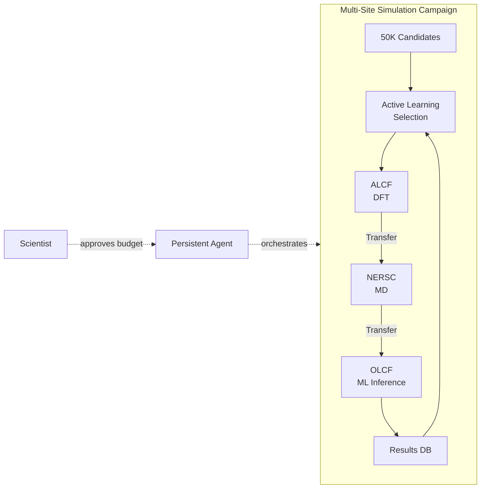
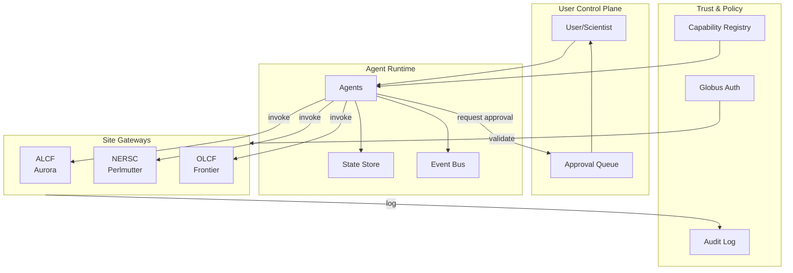
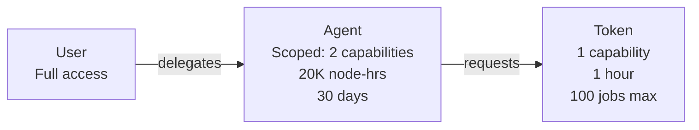
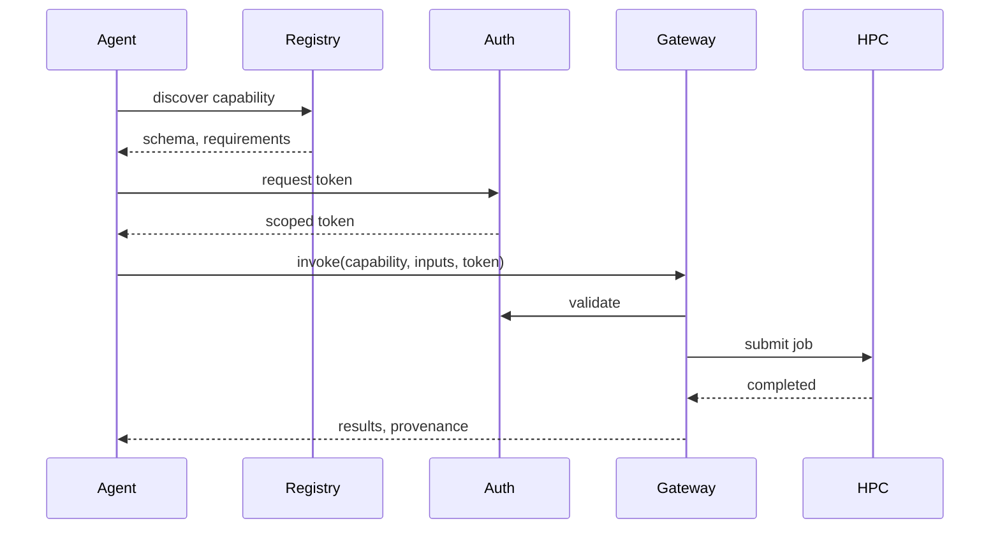
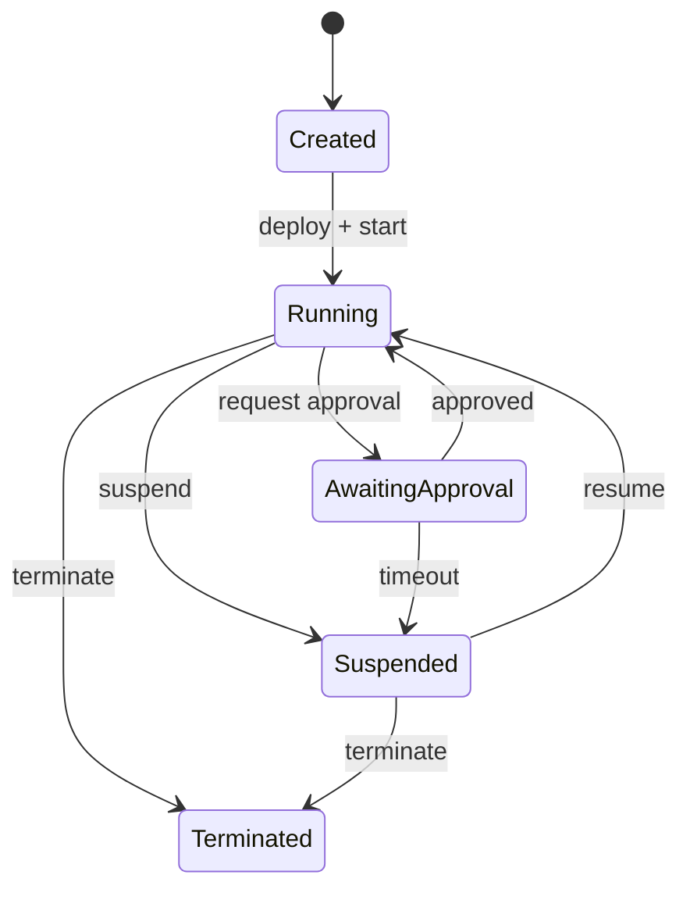

# Capability-Based Execution and Persistent Agent Framework for DOE Environments

## Table of Contents

1. [Overview](#1-overview)
2. [Problem Statement](#2-problem-statement)
3. [Use Cases](#3-use-cases)
4. [Foundation: Globus Services](#4-foundation-globus-services)
5. [Architecture](#5-architecture)
6. [Agents](#6-agents)
7. [Security](#7-security)
8. [API Surface](#8-api-surface)
9. [Implications for DOE Facilities](#9-implications-for-doe-facilities)
10. [Next Steps](#10-next-steps)

---

## 1. Overview

This document outlines an architectural model for enabling:

1. **Capability-based remote execution** across DOE sites without requiring per-user accounts at each location.
2. **Persistent, delegated agents** that can act on behalf of users, both locally and at remote sites (e.g., near HPC systems).

The goal is to move from an **account-centric model** to a **capability- and agent-centric model**, enabling scalable, secure, and interoperable multi-site scientific workflows.

---

## 2. Problem Statement

Current DOE computing environments are largely based on:

- Per-user accounts at each site
- Interactive login and manual execution
- Ad hoc automation

This model does not scale for:

- Multi-site workflows
- Autonomous or semi-autonomous agents
- Persistent, long-running scientific processes
- Fine-grained access control

We require a model where:

- Access is granted to **capabilities**, not systems
- Execution is mediated through **policy-controlled interfaces**
- Agents can operate under **delegated authority**

---

## 3. Use Cases

### 3.1 Multi-Site Simulation Campaign

A materials scientist wants to screen 50,000 candidate battery electrolyte molecules:

1. Run DFT calculations (Gaussian/VASP) at ALCF
2. Run MD simulations (LAMMPS) at NERSC
3. Run ML inference for property prediction at OLCF
4. Store results and select next batch (active learning loop)

The campaign runs for weeks. The scientist doesn't want to babysit it.



**Today**: Scientist has accounts at three facilities, writes ad-hoc scripts to poll queues and transfer data, handles failures manually, and loses coordination if their laptop closes.

**With this architecture**: An agent persists across weeks, automatically handles failures with retry/backoff, requests human approval at budget thresholds, and triggers the next stage on job completion events.

---

### 3.2 Knowledge-Updating Research Agent

A researcher wants an agent that:

1. Monitors new publications (PubMed, arXiv, bioRxiv) daily
2. Extracts relevant binding affinity data via LLM
3. Updates a local knowledge base
4. Re-trains predictive models when sufficient new data accumulates
5. Alerts the user to high-impact findings

The agent runs indefinitely as a "research assistant."

**Today**: Manual literature review is sporadic, data extraction is labor-intensive, models go stale.

**With this architecture**: Scheduled daily execution, graceful degradation (one bad paper doesn't crash the agent), human approval for expensive retraining jobs, indefinite lifespan.

---

### 3.3 Requirements Surfaced

| Aspect | Simulation Campaign | Knowledge Agent |
|--------|---------------------|-----------------|
| Duration | Weeks | Indefinite |
| Trigger | Event-driven (job completion) | Scheduled + events |
| Compute | Very high (HPC) | Low-medium (LLM, periodic training) |
| Failure mode | Retry, pause on repeated failure | Skip bad inputs, continue |

The architecture must support:

1. Both event-driven and scheduled execution
2. External APIs as capabilities, not just HPC functions
3. Human approval workflows as first-class constructs
4. Durable state that survives agent restarts
5. Budget/quota enforcement at the agent level

---

## 4. Foundation: Globus Services

This architecture builds on existing Globus infrastructure:

- **Globus Auth**: Federated identity, OAuth2 tokens, consent management, delegation
- **Globus Compute**: Remote function execution on endpoints at DOE facilities
- **Globus Transfer**: Reliable, high-performance data movement between sites

The novel contributions are:

1. **Capability Registry**: Discovery and metadata layer over Globus Compute endpoints
2. **Agent Runtime**: Persistent stateful processes that orchestrate Globus services
3. **Policy Layer**: Finer-grained authorization—capability-level rather than endpoint-level

---

## 5. Architecture

### 5.1 System Components



| Component | Role |
|-----------|------|
| **User Control Plane** | Agent creation, monitoring, approvals |
| **Agent Runtime** | Hosts persistent agents; local, cloud, or site-adjacent |
| **Site Gateways** | Expose capabilities, enforce site policy, map to schedulers |
| **Trust & Policy** | Identity federation, authorization, delegation, audit |

### 5.2 Capabilities

A **capability** is a named, policy-controlled action exposed by a site:

- `alcf.run_dft(molecule_spec, method) → energies`
- `nersc.run_md(structure, forcefield) → trajectory`
- `olcf.predict_properties(features) → predictions`

Each capability includes: execution mapping, input/output schema, resource constraints, authorization policy, and audit requirements.

### 5.3 Delegation



User authority narrows when delegated to agents; capability tokens are further scoped per invocation.

### 5.4 Invocation Flow



---

## 6. Agents

An **agent** is a persistent computational entity that:

- Maintains state over time
- Pursues goals by invoking capabilities
- Responds to events (job completion, data arrival, schedules)
- Acts under delegated authority
- Requests human approval when needed

### 6.1 Agent Runtime Requirements

| Requirement | Description |
|-------------|-------------|
| **Persistent Identity** | Agent identity distinct from user; traceable delegation |
| **Durable State** | Goals, execution history, pending tasks, credentials |
| **Event Handling** | Job completion, data availability, schedules, human approvals |
| **Observability** | Logs, metrics, traces, action history |

### 6.2 Lifecycle



---

## 7. Security

### 7.1 Threat Model

| Threat | Attack | Mitigations |
|--------|--------|-------------|
| **Token theft** | Attacker obtains delegation tokens | Short-lived tokens, bound to agent identity, anomaly detection, fast revocation |
| **Confused deputy** | Malicious input tricks agent into unauthorized action | Output destination validation, least-privilege, input validation at gateway |
| **Privilege escalation** | Agent exceeds intended scope | Delegation cannot exceed delegator's authority, budget caps at gateway |
| **Resource exhaustion** | Buggy/malicious agent submits excessive jobs | Rate limits, budget thresholds, fairshare, kill switches |
| **Agent compromise** | Attacker controls agent runtime | Sandboxing, network egress restrictions, behavioral monitoring |
| **Data exfiltration** | Agent transfers data to unauthorized location | Transfer destination policy, egress monitoring, large transfer approval |
| **Orphaned agents** | User leaves; agent persists with stale authority | Delegation tied to IdP status, max lifetime, periodic attestation |

### 7.2 Security Invariants

1. **No authority amplification**: Agents cannot gain more authority than granted
2. **Traceable actions**: Every invocation attributable to user + agent
3. **Revocable access**: Any delegation revoked within minutes
4. **Site sovereignty**: Facilities can deny any request regardless of token validity
5. **Fail secure**: Validation failures result in denial

### 7.3 Incident Response

1. Revoke agent's tokens (propagates to all sites)
2. Terminate running jobs
3. Audit logs identify all invocations
4. Notify user, facilities, security teams
5. Remediate and review

### 7.4 Policy Controls

- **Delegation**: Scope-limited, time-limited, revocable, auditable
- **Site control**: Which capabilities exposed, resource limits, policy enforcement
- **Budgets**: Quotas, approval thresholds, rate limits, kill switches

---

## 8. API Surface

### Capability API

```
discover_capabilities(site, filters) → [capability]
describe_capability(capability_id) → schema
invoke(capability_id, inputs, token) → run_id
get_status(run_id) → status
cancel(run_id)
fetch_outputs(run_id) → results, provenance
```

### Agent API

```
create_agent(spec, owner, policy) → agent_id
start_agent(agent_id)
stop_agent(agent_id)
inspect_agent(agent_id) → state
grant_authority(agent_id, scope, ttl)
revoke_authority(agent_id)
approve_action(agent_id, action_id)
```

---

## 9. Implications for DOE Facilities

### 9.1 What Facilities Provide

**Capability Gateways** (building on Globus Compute):
- Expose site-approved capabilities with schemas
- Map invocations to local schedulers (Slurm, PBS)
- Enforce site policy, handle credential translation

**Example Capabilities**:

| Facility | Capabilities |
|----------|-------------|
| ALCF | `aurora.run_dft`, `aurora.run_lammps`, `aurora.inference` |
| OLCF | `frontier.run_vasp`, `frontier.gpu_inference` |
| NERSC | `perlmutter.run_qe`, `perlmutter.data_analysis` |

**Allocation Integration**: Invocations charged to ERCAP/INCITE/ALCC allocations; fairshare applies.

### 9.2 What Facilities Retain

- Which capabilities to expose
- Who can invoke (allocation, project membership)
- Resource limits per capability/user/agent
- Security policy and override authority

### 9.3 Benefits

- **Reduced account burden**: No per-user home directories for many use cases
- **Better utilization**: Agents optimize submission, automated retry
- **Improved audit**: Capability-level logging, clear provenance

### 9.4 Adoption Path

1. Expose a few high-value capabilities
2. Add discovery and schema publication
3. Support agent-initiated invocations
4. Host site-local agent runtimes

---

## 10. Next Steps

### Infrastructure

1. Define capability schema specification (JSON Schema-based)
2. Build capability registry service
3. Implement reference gateway at one facility
4. Prototype agent runtime with state management

### Demonstrations

- Multi-site simulation campaign across ALCF, NERSC, OLCF
- Literature monitoring agent with scheduled execution

### Facility Engagement

1. Engage ALCF, NERSC, OLCF on gateway requirements
2. Coordinate on cross-site authorization and accounting
3. Identify pilot user communities

---

## Summary

This architecture enables **agentic science workflows at DOE scale** by:

- Replacing account-based access with **capability-based execution**
- Enabling **persistent, delegated agents** that operate under policy constraints
- Providing **secure multi-site interoperability** with full auditability

> Scientific computing infrastructure should evolve from account-based access to capability-based execution, and from user-driven workflows to persistent, delegated agents operating under policy-constrained authority across distributed environments.
