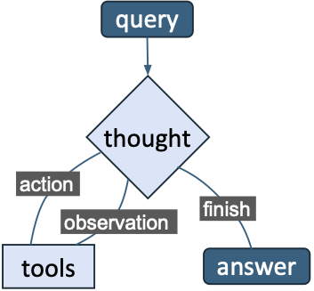
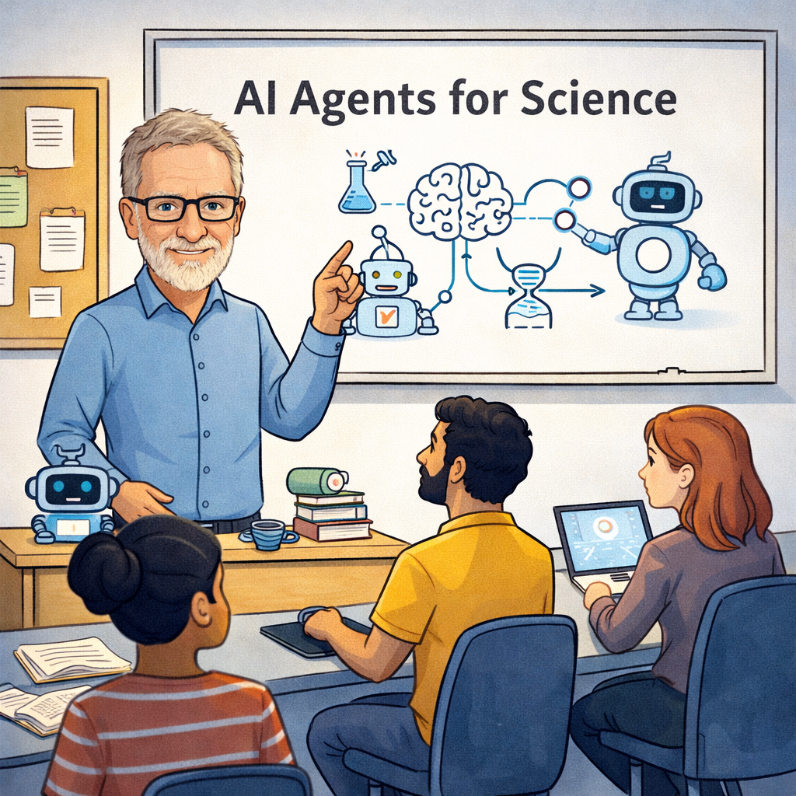
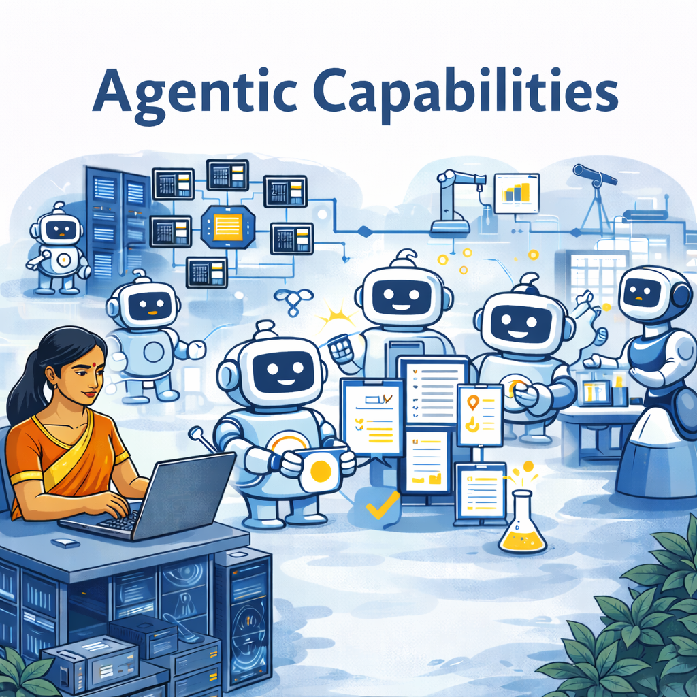
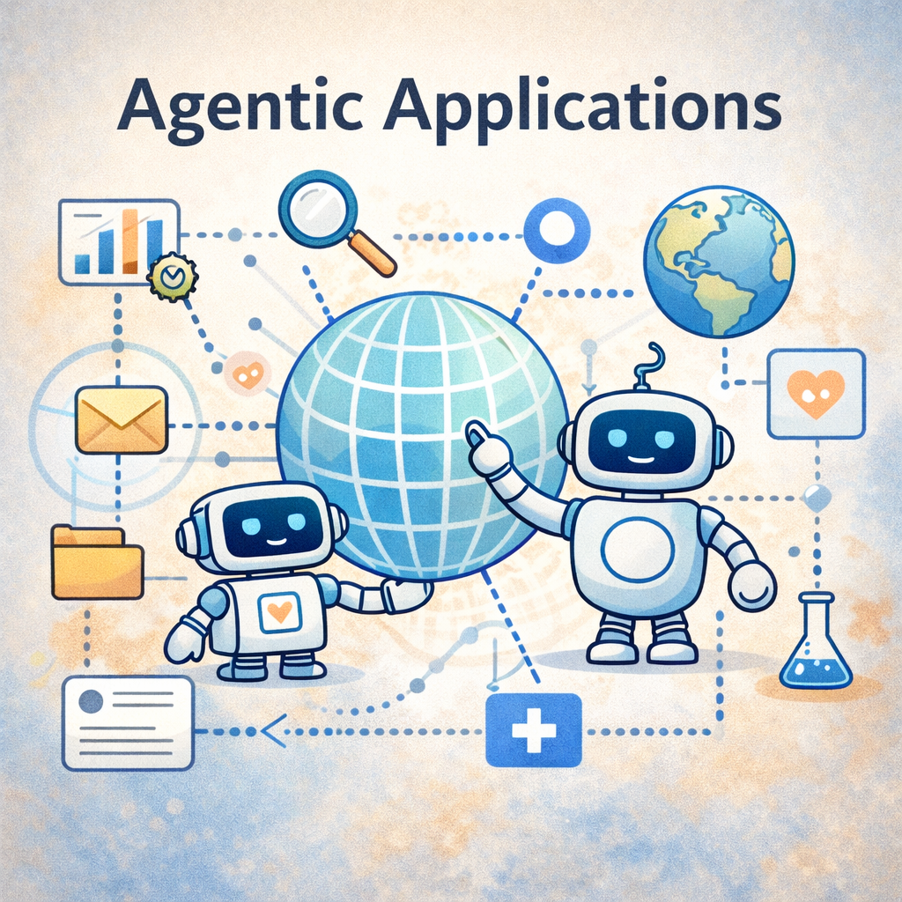

<h1 style="color: #0066cc;">AI Agents for Scientific Discovery</h1>

**Agentic discovery** combines reasoning-capable AI with scientific and engineering resources—such as literature collections, simulation codes, experimental platforms, and knowledge bases—to accelerate the pace of discovery. Recent advances in large language models (LLMs) and related technologies make it possible to build agentic systems that automate key aspects of scientific work: synthesizing information from the literature, generating and prioritizing hypotheses, designing and executing protocols, running simulations or experiments, and interpreting results.

  <!-- LEFT: all text -->
  

    

      An agent is a persistent, stateful process that acts on behalf of a user
      or system. An agent may:
    

    <ul>
      <li>Observe inputs or events</li>
      <li>Plan (decide on) actions using a policy (rules or LLM)</li>
      <li>Act: Execute tools or interact with other agents</li>
      <li>Learn: Update state to adapt over time</li>
    </ul>

    

      We can think of an agent as a
      <em>scientific assistant that can reason, act, and coordinate on our behalf</em>.
    

  

  <!-- RIGHT: image -->
  

---

      <strong><a href="Class/">Teaching</a></strong> 
      AI Agents for Science curriculum
      (University of Chicago, Autumn 2025).

<strong><a href="Capabilities/">Capabilities</a></strong> 
Deployment patterns from local prototypes to massively parallel HPC inference.

<strong><a href="Applications/">Applications</a></strong> 
Example applications of agentic systems for scientific discovery.

---

## What's New

- [Greatly expanded set of Capability examples](Capabilities/README.md) (Feb 4, 2026)
- First Agent of the Week: [OPAL — Plant Phenotyping Analysis Agent](https://github.com/AI-ModCon/BaseCAF_agent_of_the_week/blob/main/AotW-1-OPAL.md) (Jan 29, 2026)
- [Slides from a talk at Trillion Parameter Consortium meeting](Assets/systems.pdf) on systems requirements for scalable agentic AI (Jan 28, 2026)
- [Slides from a talk at U. Würzberg](Assets/wurzberg.pdf) (thanks to host [S. Kounev](https://se.informatik.uni-wuerzburg.de/staff/samuel-kounev/)) covering agents for scientific discovery, Academy agent framework, and agency as new organizing abstraction for CS (Jan 22, 2026)
- Pointer to [**Agent of the Week program**](Applications/README.md) (Jan 16, 2026)
- Web site updated to include pointers to Frameworks and Applications (Jan 15, 2026)
