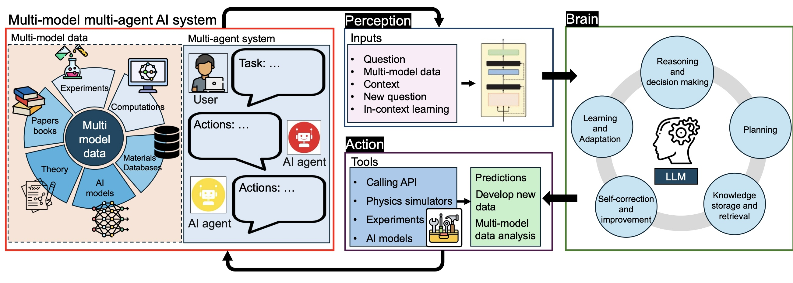
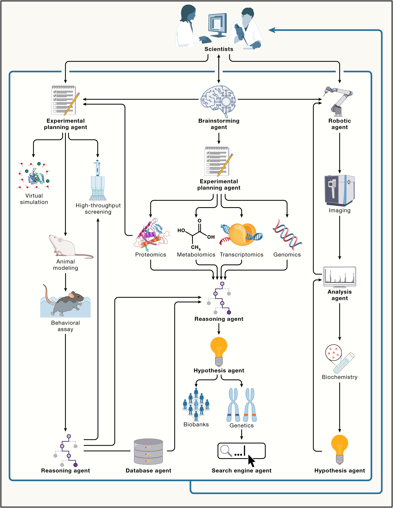

# Agentic Scientific Discovery Platforms

**NOTE: Class scheduled as CMSC 35370 for Autumn 2025. Please contact [Ian Foster](mailto:foster@uchicago.edu) with any questions.**

Please see this [draft curriculum](curriculum.md).

An agentic **Scientific Discovery Platform** (SDP) is an integrated environment that combines reasoning-capable AI with scientific and engineering resources—such as literature collections, simulation codes, experimental platforms, and knowledge bases—to accelerate the pace of discovery. Recent advances in large language models (LLMs) and related technologies make it possible to build such platforms that can automate key aspects of scientific work: synthesizing information from the literature, generating and prioritizing hypotheses, designing and executing protocols, running simulations or experiments, and interpreting results.

To explore and advance these ideas, we are offering this intensive class in Fall 2025. The course is targeted at graduate students and advanced undergraduates eager to engage with this emerging field, but we also welcome postdocs, scientists, and faculty who are prepared to participate actively. The class emphasizes “learning by doing”: instructors will provide infrastructure, working examples, and state-of-the-art perspectives on agentic AI and scientific discovery, while students will design, build, and apply their own SDPs to tackle domain-relevant problems.

We welcome as participants both **domain scientists**, who may be most interested in how to apply such platforms, and **computer scientists**, who may be most interested in how to build them. Our aim is to create a mutually instructive environment in which diverse expertise contributes to advancing the science and practice of agentic discovery.

## Initial class details

The class will take place on the Hyde Park campus of the University of Chicago during the Autumn Quarter 2025, i.e., starting September 29, 2025, as **CMSC 35370-1: AI Agents for Science**.

We will organize access to powerful data and computing resources, including at the University of Chicago's [Research Computing Center](https://rcc.uchicago.edu) and the [Argonne Leadership Computing Facility](https://alcf.anl.gov), and autonomous laboratory capabilities.

## Background information on AI Agents for Science

The following figure from [Ghafarollahi and Buehler, 2024](https://arxiv.org/pdf/2407.10022) illustrates a multi-model multi-agent approach to materials discovery, modeling, and prediction.

The following figure from [Gao et al.](https://www.cell.com/cell/fulltext/S0092-8674(24)01070-5) shows examples of AI agents in biology.

