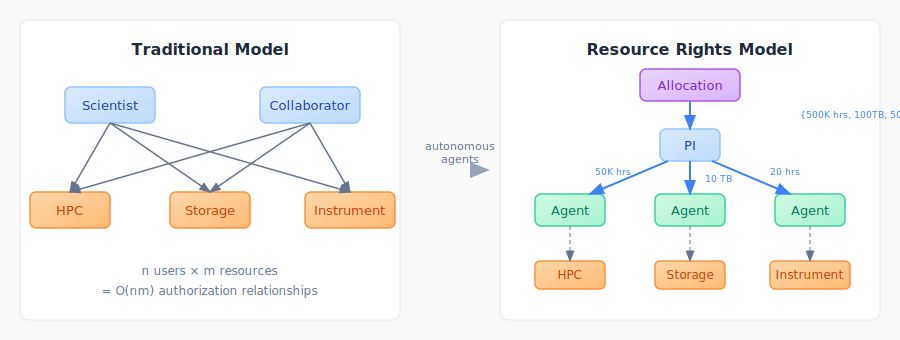
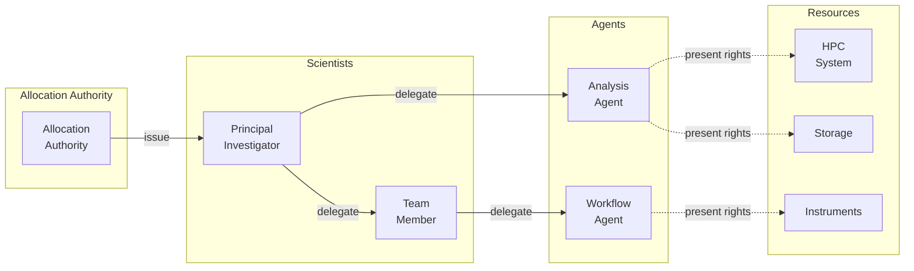

# Resource Rights Architecture

*Scalable authorization for autonomous scientific agents*

Scientific cyberinfrastructure is undergoing a fundamental transformation as autonomous AI agents become active participants in scientific discovery. Rather than serving solely as interactive assistants, these agents increasingly design simulations, analyze experimental results, orchestrate workflows, control laboratory instruments, and coordinate complex computational campaigns.

**The challenge:** Existing authorization mechanisms were designed for direct human interaction with individual resources. They do not scale naturally to machine-mediated science where thousands of agents act on behalf of researchers across federated facilities.

**A potential solution:** The *Resource Rights Architecture* treats authority as an explicit, measurable, delegable, and revocable object—independent of the identity currently exercising it. Resource rights represent the authority to consume or manipulate scientific resources: computational allocations, storage capacity, instrument time, repository access, workflow execution, and AI services.

---

## Documents

<h3><a href="resource-rights-architecture.pdf">Resource Rights Architecture</a></h3>

<em>The main paper</em>

Presents the resource rights abstraction and the federated authorization model in which allocation authorities issue resource rights, scientists delegate bounded subsets to autonomous agents, and resource providers authorize requests by validating presented rights against local policy.

<strong>Key topics:</strong> Resource rights model, delegation chains, runtime authorization, security properties, threat model

<h3><a href="delegation-service.pdf">Delegation Service Specification</a></h3>

<em>Technical specification</em>

Detailed specification of the Delegation Service that manages resource right delegation chains, validates constraints, and provides runtime authorization decisions for autonomous agents operating within scientific cyberinfrastructure.

<strong>Key topics:</strong> API specification, delegation protocol, constraint validation, revocation handling

<h3><a href="alcf-implementation.pdf">ALCF Implementation Design</a></h3>

<em>DOE facility deployment</em>

Implementation design for deploying the Resource Rights Architecture at the Argonne Leadership Computing Facility (ALCF), showing how the architecture integrates with existing DOE identity management, allocation systems, and HPC schedulers.

<strong>Key topics:</strong> ALCF integration, PBS hooks, Globus Auth, allocation mapping

---

## Prototype Implementation

A reference implementation of the core Delegation Service is available:

<h3><a href="prototype/">Delegation Service Prototype</a></h3>

Python implementation demonstrating delegation chain validation, constraint propagation, and runtime authorization queries. Includes test suite and example delegation scenarios.

<pre><code>ResourceRights/prototype/
├── src/                    # Core implementation
├── tests/                  # Test suite  
├── delegations.json        # Example delegation chains
├── pyproject.toml          # Package configuration
└── README.md               # Setup and usage guide
</code></pre>

<strong>Quick start:</strong>

<pre><code>cd prototype
pip install -e .
pytest                      # Run tests
</code></pre>

---

## Key Concepts

| Concept | Description |
|---------|-------------|
| **Resource Right** | A transferable token representing bounded authority over a scientific resource |
| **Delegation Chain** | A sequence of delegations from an allocation authority through intermediaries to an agent |
| **Constraint Narrowing** | Each delegation may only narrow (never expand) the constraints of its parent |
| **Runtime Authorization** | Resource providers validate presented rights against local policy at request time |
| **Revocation** | Any link in a delegation chain can be revoked, immediately invalidating all downstream rights |

---

## Architecture Overview

The architecture separates **identity**, **authority**, **policy**, and **accounting** into independent concerns:

- **Identity providers** authenticate principals and agents
- **Allocation authorities** issue resource rights against allocations  
- **Delegation services** manage delegation chains and validate constraints
- **Resource providers** enforce local policy and track consumption

---

## Related Work

This architecture builds on concepts from:

- **Capability-based security** (Dennis & Van Horn, 1966)
- **SPIFFE/SPIRE** federated identity
- **Macaroons** for contextual caveats
- **OAuth 2.0** delegation patterns

See the [Related Work section](resource-rights-architecture.pdf#section.12) in the main paper for detailed discussion.

---

## Contact

For questions or collaboration inquiries, contact the authors through the [Agents for Science](../) community.
